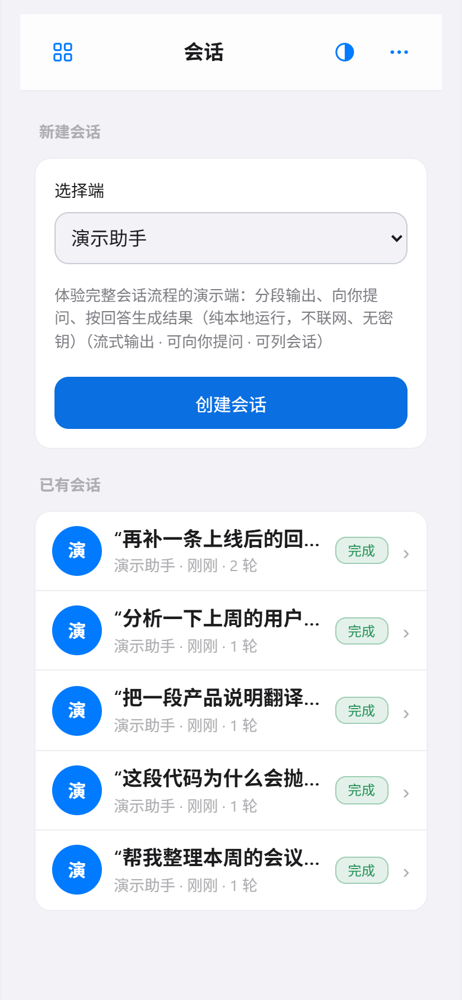
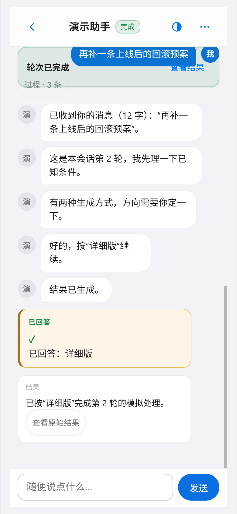
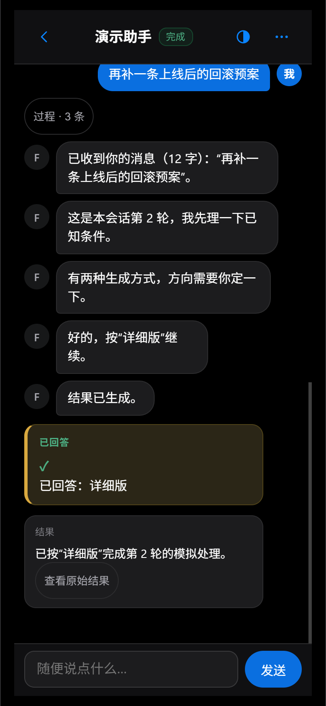

# 掌坞（palmdock）

> **通用手机/电脑 AI 交互底座**：公共层——手机页面 + 连接 + 会话/任务机制 + 鉴权 + 契约——是成品；接新端只需在 `src/adapters/` 加**一个适配器**。
>
> ⚠️ **这是演示项目，不是可部署产品**：单人单机、明文局域网 HTTP、单一固定 token、无多用户/权限分级、无公网推送；**不要直接暴露到公网**。
>
> **30 秒上手**：`npm install --ignore-scripts` → `npm run build` → `npm run token` → 按 `config.example.json` 配置 `config.json`（手机访问需 `"bind": "lan"`）→ `npm start`
>
> **文档地图**：`ADAPTERS.md`（接新端 / 生产侧）· `API.md`（写客户端 / 消费侧契约）· `docs/DEMO.md`（演示指南）· `docs/VERIFICATION.md`（验证状态与已知缺口）

<p align="center">  </p>

供 AI 按需适配的**通用基础环境**：公共手机网页、通信、鉴权、任务状态与结果展示由底座提供；
目标工具的差异集中在 `src/adapters/` 下的适配器。新增受支持工具 = 写一个适配器 + 在注册表加一行，
不必重写公共页面、通信与鉴权。

> 本仓库是**底座**，不是完整的远程 Coding Agent 产品：公共层（页面、通信、鉴权、会话与任务机制）是成品，
> 目标端的差异全部落在 `src/adapters/`。仓库内附示例端：一次性任务端（文本统计 / 目录清单 / 端砚 MCP 只读查询）
> 与会话端（本地演示助手 `fake-ai`、按 DSH `/api` 协议接入真实 DeepSeek Harness 的 `dsh-agent`）。
> 接你自己的端只需新增一个适配器，见 `ADAPTERS.md`。

## 技术选型

- Node.js（开发环境 v24.20；选用当前受支持版本，不锁死具体次版本号）+ TypeScript（tsc 编译，CommonJS 输出）
- Express 5（HTTP API + 静态页面）、zod 4（输入契约与校验）
- better-sqlite3 13（持久化；WAL + synchronous=FULL，单进程事务串行写、原子提交）
- 前端：五个静态页（会话主页 / 工具 / 表单 / 任务详情 / 入口跳转桩）+ 原生 JS；**会话层用 SSE**（fetch 流式读取 + 通用事件名 hello/change + 注释心跳；**前端**无 WebSocket——仅 `dsh-agent` 适配器用 WebSocket 连 DSH 的事件通道），**任务层保留 HTTP 轮询**；回答正文按**安全 Markdown 渲染成 DOM**（HTML 一律当文本）；提醒用 WebAudio/振动/标题/页内提示条通道，系统通知需 HTTPS（不支持时降级并在页面明确标注）；不依赖仅 HTTPS 可用的浏览器 API
- 无动态代码执行、无自动插件扫描：适配器**显式注册**

## 目录职责

| 路径 | 职责 |
|---|---|
| `src/types.ts` | 任务状态机、适配器契约、事件、限制的共享类型 |
| `src/config.ts` | 配置加载（环境变量 > config.json > 默认值） |
| `src/store.ts` | SQLite 持久层：任务、事件、状态迁移强制、上限裁剪 |
| `src/state.ts` | 合法状态迁移表 |
| `src/runner.ts` | 进程内调度执行、超时只提示、结果截断、重启恢复 |
| `src/registry.ts` | 适配器显式注册表 + 清单自检 |
| `src/schema-fields.ts` | zod schema → 前端表单字段定义（单一来源派生） |
| `src/api.ts` | HTTP API（见下） |
| `src/auth.ts` | 固定 token 鉴权（sha256 + timingSafeEqual） |
| `src/server.ts` | Express 装配（安全头、CSP、静态页面） |
| `src/index.ts` | 入口：配置 → 持久层 → 恢复 → 启动 → 优雅关闭 |
| `src/adapters/text-stats.ts` | 工具 A：文本统计（多行文本输入 + percent 进度） |
| `src/adapters/dir-listing.ts` | 工具 B：目录清单（选项输入 + 消息流进度 + 只读白名单目录） |
| `src/adapters/inkstone-mcp.ts` | 工具 C：书生·端砚 MCP stdio 工具清单（外部程序，只读元数据级别） |
| `src/adapters/inkstone-mcp-stdio.ts` | 两个 inkstone 适配器共用的 MCP stdio 会话（路径/JSON-RPC/子进程管控） |
| `src/adapters/inkstone-biorxiv-categories.ts` | 工具 D：端砚 MCP 工具调用——bioRxiv 类目（固定 server+tool，空参数只读查询） |
| `src/adapters/fake-ai.ts` | 工具 E（会话形态）：假 AI 演示端（spawn 本地脚本，协议翻译） |
| `src/adapters/dsh-agent.ts` | 工具 F（会话形态）：**真实公开协议**适配器——按 DeepSeek Harness 自身声明的 `/api` 协议接入真实 dsh web（需环境变量 `DSH_BASE_URL`，详见 `ADAPTERS.md`） |
| `src/session-runner.ts` | 会话轮次运行器（第二层）：ask 挂起/恢复、AbortSignal dispose、中断恢复 |
| `src/session-api.ts` | 会话 HTTP API：创建会话 / 发消息（幂等）/ 回答（幂等）/ 重连视图 / SSE 流 |
| `src/turn-bus.ts` | 轮次变更总线：持久层事务提交后通知订阅者（推流触发点） |
| `src/session-stream.ts` | 会话 SSE 推流中心：hello/change 快照 + sinceSeq 续传 + 心跳 + 关闭清理 |
| `src/session-state.ts` | 轮次状态机（streaming / awaiting_answer / answered / 终态） |
| `src/result-guard.ts` | 结果序列化与体积截断（任务与轮次共用同一规则） |
| `fake-ai/agent.js` | 演示助手（fake-ai）本地脚本（纯本地、无网络、无密钥、行为固定） |
| `fake-dsh/server.js` | dsh-agent 的可控“假协议端”测试替身（文档化 DSH `/api` 协议的最小实现，仅供测试） |
| `public/session.html` | 会话主页（应用入口）：未授权配对卡；列表视图（会话列表 + 新建会话）+ 聊天详情（消息输入 + SSE 流式事件 + 二选一问答 + 通知行 + 历史轮次） |
| `public/tools.html` | 工具页（二级）：一次性任务端分区，按能力展示入口 |
| `public/index.html` | 入口跳转桩：统一跳转到 `/session.html` |
| `src/tools/gentoken.ts` | 生成 token 写入 config.json（`npm run token`） |
| `public/` | 公共手机网页（会话主页 / 工具 / 表单 / 任务详情 / 入口跳转桩） |
| `tests/` | 全部测试（见下） |
| `docs/CLOUDFLARE-TUNNEL.md` | 跨网接入说明（不实际配置，仅文档） |
| `android-shell/` | 示例 Android 客户端（**可选、非框架部分**：WebView + 前台服务 + 原生系统通知；由另一个 AI 独立写出、公共层零改动；**真机未验证**，可整目录删除） |

## HTTP API

所有 `/api/*`（除 `/api/health`）都需要 `Authorization: Bearer <token>`，token 不出现在 URL 或日志。

| 方法 路径 | 说明 |
|---|---|
| `GET  /api/health` | 不需 token，仅返回 `{ok:true}`，用来区分“可达但未授权”与“不可达” |
| `GET  /api/tools` | 已注册工具清单（含表单字段定义） |
| `POST /api/tasks` | 提交任务：`{toolId, idempotencyKey, input}`，**创建即返回 taskId，不等执行** |
| `GET  /api/tasks?limit=` | 最近任务列表 |
| `GET  /api/tasks/:id?sinceSeq=` | 任务详情 + 事件（`sinceSeq` 支持增量轮询） |

### 会话 API（第二层）：同一鉴权与事件模型

| 方法 路径 | 说明 |
|---|---|
| `POST /api/sessions` | `{toolId}` 创建会话（仅对声明了会话能力的工具，否则 409） |
| `GET  /api/sessions?limit=` | 会话列表（轮次数 / 末轮状态） |
| `GET  /api/sessions/:id` | 会话详情：历史轮次 + 活跃轮次全部事件（**断线重连视图**） |
| `POST /api/sessions/:id/messages` | 发送消息 `{message, idempotencyKey}`，每会话同时只允许一个活跃轮次 |
| `POST /api/sessions/:id/turns/:turnId/answer` | 回答 `{answer}`，**幂等**：同一回答重复提交不会二次继续执行 |
| `GET  /api/sessions/:id/turns/:turnId?sinceSeq=` | 轮次详情 + 事件增量 |
| `GET  /api/sessions/:id/stream?sinceSeq=` | 会话 SSE 流：`hello`（快照）→ `change`（增量事件 + 轮次状态）+ 注释心跳；断线以 sinceSeq 续传，不丢不重 |

轮次状态协议：`streaming`（仍在输出）/ `awaiting_answer`（等待手机回答）/ `answered`（已回答继续执行）/
`succeeded` / `failed`（失败带证据）/ `interrupted`（服务中断，结果未知，不重跑）。
适配器能力声明（`capabilities`）决定公共页面渲染哪些入口——不支持的能力明确标记，不留空按钮。
手机页面到达“使用水平”的三件公共能力（与端无关）：
- **会话列表**：`session.html` 无 id 时的列表视图（会话主页；未授权先显示配对卡）（末轮状态徽标 + 消息预览 + 点击继续）。
- **SSE 实时推流**：页面打开会话即连接 `/stream`（带 token 的 fetch 流），事件与状态变更即时到达；
  连接断开自动回退 1.5s 轮询并以 sinceSeq 重连续传（传输不可靠 ≠ 状态丢失：持久层是权威视图）。
- **网页提醒**：会话页提供四条通道——声音（WebAudio 合成，提问上行两声、完成/失败下行两声，无音频文件）、
  振动、标题徽标（`【待回答】`闪烁）、页内"收到提问"提示条（点击滚到提问卡）；前台与后台标签页均触发，
  后台标签页用静音保活通道维持事件到达；"关闭提醒"总闸关后声音与振动零残留。**系统通知需 HTTPS**
  （明文 HTTP 局域网下不可用，页内明确标注“需要 HTTPS——需走跨网隧道”）。完全关闭浏览器
  仍想收到通知需要系统级推送服务（公网暴露），**安全边界禁止**，属已知缺口。
- **本地缓存秒开**：会话内容按会话 id 缓存在浏览器 localStorage（`agb_sess_<id>`，带 schema 版本号，
  不含 token）；再次打开先用缓存**立刻渲染**、顶部短暂标注"更新中…"，再向服务器刷新；
  断网时明确显示“离线，显示的是上次内容”；提问卡缓存为“待回答”时，刷新确认后立即更正。
演示助手（fake-ai）固定行为：收消息 → 3 段输出 → 二选一提问 → 回答后 2 段收尾 → 结果；
消息为“失败”或“fail”时确定性地失败（输出一段后 fatal，失败轮次带 `error` 证据、无结果）。

### 为什么仓库里有一个演示助手（fake-ai）

`fake-ai` 是会话层的**量具**，不是冒充真实模型的假 AI。它存在有三个用途：

1. **测试替身**：真实模型的回答不确定、无法断言；`fake-ai` 行为完全固定（见上一段），
   让状态机、提问-回答幂等、断线 sinceSeq 续传、并发 409、失败流程都能被确定性验证——
   `tests/sessions.test.ts`、`tests/session-stream.test.ts`、`tests/frontend-events.test.ts`、
   `tests/frontend-markdown.test.ts` 共约 13 处断言依赖它。
2. **适配参照样例**：`src/adapters/fake-ai.ts` + `fake-ai/agent.js` 是最小、完整、可跑的
   会话端实现（适配器只做协议翻译与子进程管控）；照它就知道一个会话端长什么样、
   `runTurn` 的 `emit`/`ask` 契约如何落地。
3. **零密钥离线演示**：纯本地脚本（不联网、无密钥、不读写用户文件），装好底座即可
   跑完整会话流程：分段流式输出 → 二选一提问 → 手机回答 → 结果。

它不是真实模型，也不代表底座只有假端——仓库另有按 DSH 公开 `/api` 协议接入真实
DeepSeek Harness 的 `dsh-agent` 与若干一次性任务端；界面上它排在端清单最后，文案为
「体验完整会话流程的演示端：分段输出、向你提问、按回答生成结果（纯本地运行，不联网、无密钥）」。

### 任务状态与边界语义（这是本底座的核心约定）

```
pending → running → succeeded
                    └→ failed
pending|running → interrupted   （仅服务重启时，结果未知，不重跑、不伪称已停止）
running 不因超时变状态           （超时只打 timeoutMarkedAt + 系统事件提示“仍未确认结束”）
```

- **幂等键**：客户端生成 `idempotencyKey`。同 key 同参数 → 返回已存在任务（200，不重复执行）；
  同 key 异参数 → **409 IDEMPOTENCY_CONFLICT**（附 existingTaskId）。网络失败重试**复用同一键**。
- **提交请求超时 ≠ 任务未创建**：提交是“创建即返回”，手机端可用同一幂等键重查/重提。
- **断网 ≠ 任务失败**：前端轮询失败只显示连接横幅，不清空已刷新出的状态与事件。
- **服务重启**：未终结（pending/running）任务标记为 `interrupted` 并写系统事件说明结果未知；
  适配器随服务进程运行，若派生独立子进程，该子进程可能仍在运行——底座不重跑也不声称其已停止。
- **失败必须有证据**：`failed` 任务带 `error.{message, detail?, stage?}`，适配器抛异常时记录堆栈前 4 行。

## 启动与测试

```bash
npm install --ignore-scripts  # 必须带该参数：带 lock 安装时 npm 会尝试对 better-sqlite3 走 node-gyp 构建，无 VS C++ 工具链的机器会失败；该依赖集没有需要本地编译的包，预编译二进制随 tarball 提供（可复现记录见 docs/DEMO.md「从零安装与测试」）
npm run token          # 生成随机 token 写入 config.json（不在控制台打印）
npm run build          # tsc 编译到 dist/
npm start              # 前台启动服务（依赖当前终端，终端关闭进程即被树终止）
npm run serve          # Windows：以独立进程常驻启动（WMI 创建，不依赖当前会话）
npm test               # 编译并运行全部测试（计数与明细见 docs/VERIFICATION.md）
```

### Windows 独立常驻启动（`npm run serve`）

`npm start` 前台运行时，进程属于启动它的命令会话；该会话结束（终端关闭、
Agent 命令超时）会把整棵进程树一并终止——表现正是“短暂监听后退出、无异常栈、无日志”，
这不是应用崩溃。`npm run serve`（= `scripts/serve.ps1`）用 `Win32_Process.Create`（WMI）
创建进程，它不属于任何命令会话树，因此跨会话常驻。

- **幂等**：端口监听者已是本服务（命令行含 `index.js` 且 `/api/health` 200）时直接报
  “已在运行”，不做二次启动。
- **日志**：stdout/stderr 全量重定向到项目根 `server.log`；进程内未捕获异常/未处理拒绝会先写明
  日志再优雅退出（`src/index.ts` 的 `uncaughtException`/`unhandledRejection`/exit 处理器）。
  被外部强杀（任务管理器/树终止）时进程无法自我记录——那属于启动机制问题，重跑 `npm run serve` 即可。
- **停止**：`Stop-Process -Id <listener pid>`（pid 见启动输出或 `netstat -ano | findstr :<端口>`；端口为 `config.json` 的 `port`，默认 8787）。
- 注意：`.ps1` 含中文注释，以 **UTF-8 with BOM** 保存；Windows PowerShell 5.1 对无 BOM 的 UTF-8
  会按本地 ANSI 解码，乱码字节会破坏 `param()` 默认值（`$Log` 变空 → 重定向目标拼出空文件名）。

环境变量（优先级高于 config.json）：`BASE_TOKEN`、`BASE_PORT`、`BASE_BIND`（`loopback`|`lan`）、
`BASE_DATA_DIR`、`BASE_MAX_TASKS`、`BASE_MAX_CONCURRENT`。`config.example.json` 是配置模板。

`inkstone-mcp` 适配器依赖环境变量 `INKSTONE_HOME`（书生·端砚安装目录，须自行设置，例：`set INKSTONE_HOME=D:\inkstone`），
它调用目标自带的封闭 Python 执行其 stdio MCP 服务器，只做工具清单级别的只读查询（不调用任何工具）。
`inkstone-biorxiv-categories` 共用同一入口与 `INKSTONE_HOME`，固定调用 mcp_biorxiv 的
`get_categories`（空参数、readOnlyHint=true、调用前三重校验），属于真实只读工具调用。

## 默认网络暴露与手机访问

- **默认 `bind=loopback`**（127.0.0.1）= 最小暴露；此时手机访问不到。
- 同 Wi-Fi 测试：`config.json` 设 `"bind": "lan"` → 监听 0.0.0.0，手机打开 `http://电脑局域网IP:<端口>`（端口为 `config.json` 的 `port`，默认 8787），
  未授权先显示配对卡，填访问口令（仅存本机浏览器 localStorage，经请求头发送）后进入会话主页。
- 跨网（出门在外）：见 `docs/CLOUDFLARE-TUNNEL.md`（固定域名隧道；**本文档仅为配置说明，未实际配置与实测**）。

**明文 HTTP 的限制**：局域网模式为明文 HTTP，token 与数据在链路上明文传输；
页面不使用仅 HTTPS 可用的浏览器 API，功能不受影响；跨网建议走带 TLS 的隧道。

## 限制与安全边界

- 适配器是**受信任的进程内代码**（不是沙箱；测试通过 ≠ 隔离）。公共层不提供任意 Shell 输入入口；
  新适配器须由人审阅后放入 `src/adapters/` 并显式注册。底座不在运行中加载未经确认的代码。
- 目录类示例工具只允许读固定白名单 `data/listing-root`，不接受任意路径输入。
- 输入上限 16KB、结果上限 64KB（超限截断并存证）、单任务事件上限 200 条、终态记录上限 `maxTasks`（默认 500），
  并发上限默认 4（**任务层与会话层各自一个**），请求体上限 64KB。
- token 不硬编码、不进 URL/日志/仓库（config.json 已 .gitignore）；工具输出与端回答正文按**安全 Markdown**
  渲染成 DOM（HTML 一律当文本，绝不直接作为 HTML 注入）。
- 暂不做：暂停/取消轮次、PWA、多用户/细粒度权限、插件市场、任务层 SSE（会话层已具备）、系统级推送（关闭浏览器后仍能收到通知，需要公网服务）。
- 单实例写同一数据库（多进程写同一库不受支持）。

